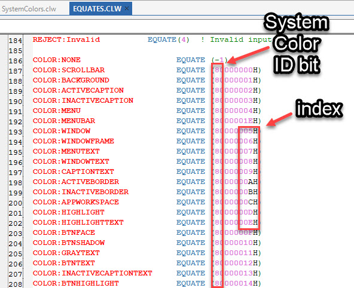

# SystemColor
An Explanation of System Colors in Clarion

"System" color equates, such as `COLOR:BtnFace` are special kinds of colors when it comes to the Clarion RTL. 

While "normal" color equates, such as COLOR:Red explicitly provide the Red/Green/Blue proportions in order to render a color on the screen, "system" colors simply provide a special index number from which the RGB can be looked up.

System colors are identified when 080000000h is turned on. The use of that particular value for this purpose means that it would be pretty difficult for Clarion to start supporting color transparencies, as this would normally be the "alpha" channel. When that system color bit is turned on, then the remainder of that value is used to look up the color using [GetSysColor()](https://learn.microsoft.com/en-us/windows/win32/api/winuser/nf-winuser-getsyscolor).

The example program loads each of the system colors represented in EQUATES.clw, and gets their actual RGB, based on the current users' Windows color settings.

